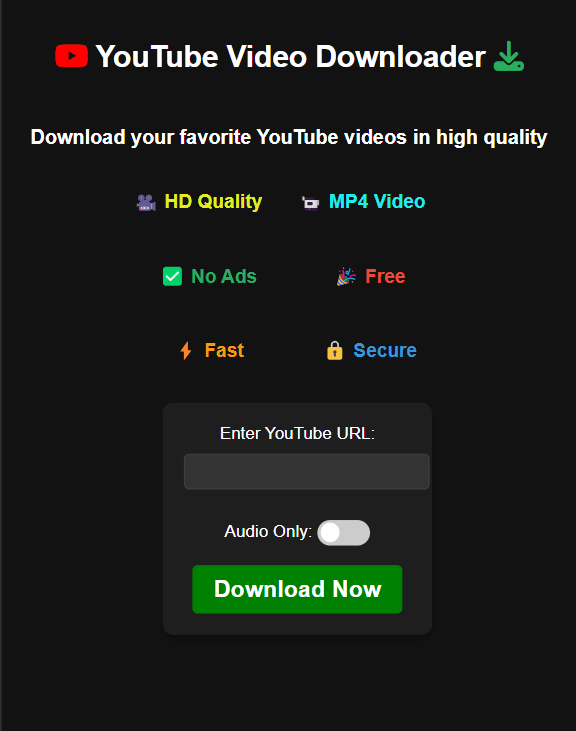

# YouTube Video Downloader

This is a Django-based YouTube Video Downloader application that allows you to download YouTube videos in both video and audio formats.

## Screenshots

### Main Interface


### Download Progress


### Download Complete


### Downloads Folder (Proof)


### Responsive


## Features
- Download video from YouTube.
- Convert YouTube videos to audio.
- Download Audio Only from Youtube Video.
- Progress tracking using Django's caching.
- Clean and responsive user interface
- No ads or popups
- Secure downloads

## Setup

### Virtual Environment Setup
1. Create a virtual environment:
   ```bash
   # Windows
   python -m venv venv
   
   # Linux/MacOS
   python3 -m venv venv
   ```

2. Activate the virtual environment:
   ```bash
   # Windows
   .\venv\Scripts\activate
   
   # Linux/MacOS
   source venv/bin/activate
   ```

### Project Setup
1. Install dependencies (with activated virtual environment):
   ```bash
   pip install -r requirements.txt
   ```

2. Navigate to the project directory:
   ```bash
   cd youtube_downloader
   ```
    
3. Run migrations:
   ```bash
   python manage.py migrate
   ```

4. Start the development server:
   ```bash
   python manage.py runserver
   ```

## Usage
1. Visit `http://127.0.0.1:8000/download/` in your browser
2. Paste a YouTube URL in the input field
3. Toggle "Audio Only" if you want just the audio
4. Click "Download Now" and wait for the process to complete
5. Files will be saved to your Downloads folder

## Development Notes
- Always activate the virtual environment before running the project:
  ```bash
  # Windows
  .\venv\Scripts\activate
  
  # Linux/MacOS
  source venv/bin/activate
  ```
- To deactivate the virtual environment:
  ```bash
  deactivate
  ```
